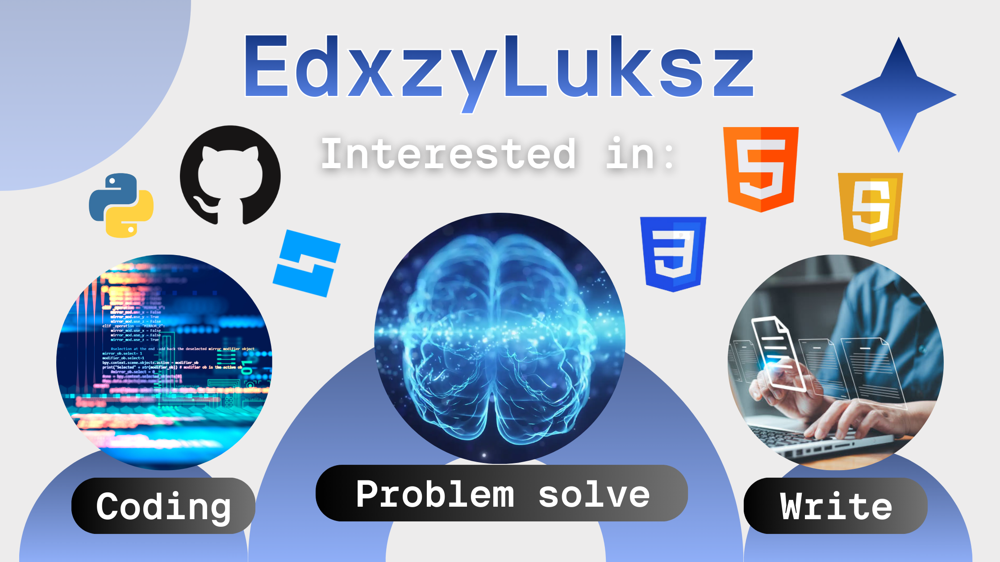

<h1 align="center">Bem-vindo. Meu nome é Eduardo, com alias virtual "EdxzyLuksz".</h1>

  

Atualmente tenho 16 anos, e me insiro no mundo dev através do curso técnico de <a href="https://github.com/edxzyluksz/Desenvolvimento-de-Sistemas">Desenvolvimento de Sistemas</a> dado por professores incríveis pela instituição SENAI - Serviço Nacional de Aprendizagem Industrial. Para mais informações, clique no hiperlink que contém todos os aprendizados atuais em um repositório à parte.

Meu hobby é a busca pelo aprendizado. Conhecer e entender todas as vertentes presentes em um computador binário moderno, desde circuitos impressos comuns até em como os sinais elétricos são capazes de exibir tudo que é feito digitalmente - Tópicos que seriam mais que interessantes para estudar, dado minha paixão pela internet desde cedo, como um usuário.

Devido a necessidade de especialização para destaque, tornar-me Full-Stack em linguagens de propósito geral e paralelamente um desenvolvedor independente para jogos, com atualmente ideias de pequenos projetos para a plataforma Roblox. Consequentemente, percorrerei pela fase do aperfeiçoamento de artes digitais, modelagem 3D, produção de trilhas sonoras e pela programação, tal último está em andamento pela própria duração do curso técnico e priorizado.

A IDE na qual estou mais familizariado é Roblox Studio por conhecer a sintaxe básica do Lua, além de entender o funcionamento da plataforma sobre suas diretrizes, trending games atuais e publicação de itens virtuais pagos.

